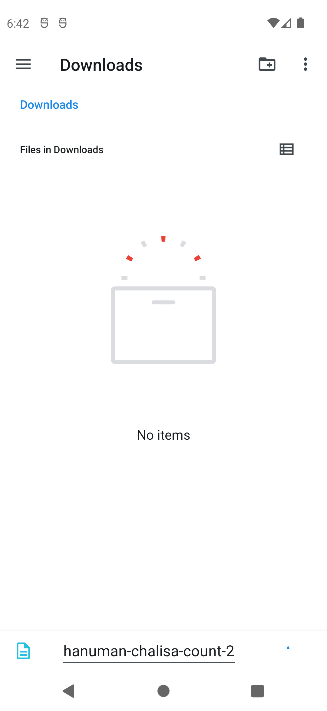

# Chalisa Counter

A small, offline Android app for tracking a Hanuman Chalisa sadhana — 100 recitations a day across
40 days. Tap to count, and export the whole cycle to a text file when you are done.

<p align="center">
  
</p>

## Why you might trust it with your practice

- **No permissions at all.** The manifest declares none. Everything is stored locally in a Room
  database on your device.
- **No network access, no analytics, no accounts.** Your counts never leave your phone unless you
  export them yourself.
- **Open source under the MIT license.** You can read every line, and rebuild the APK yourself to
  confirm it does what this README says.

## Install

Download the latest `.apk` from the [Releases page](../../releases) and open it on your device.

Requirements: **Android 7.0 (API 24) or newer**.

Two things to know about installing outside the Play Store:

- Android will warn you about installing from an **unknown source**. That warning is expected for
  any sideloaded app; you will need to allow it for your browser or file manager.
- **Sideloaded apps do not update themselves.** Check the Releases page when you want a newer
  version.

Prefer to build it yourself? See below — that is the surest way to know what you are running.

## Building from source

You will need **JDK 17 or newer** (this project is developed against JDK 21) and the Android SDK.
The simplest route is [Android Studio](https://developer.android.com/studio), which bundles both;
open the project folder and it will sync automatically.

From the command line:

```bash
./gradlew test           # run the unit tests
./gradlew assembleDebug  # build a debug APK
```

The debug APK lands in `app/build/outputs/apk/debug/`. It is signed with the standard Android debug
key, which is fine for trying the app on your own device but **not** suitable for sharing — see the
note under [Releasing](#releasing).

Gradle reads your SDK location from `local.properties`, which Android Studio creates for you. It is
gitignored because it holds an absolute path specific to your machine.

## Project layout

The code follows a domain / data / presentation split, with dependencies pointing inward — the
domain layer knows nothing about Room or Compose.

```
app/src/main/java/com/hanumanchalisa/counter/
├── domain/         # Models, repository interfaces, use cases. Pure Kotlin, no Android deps.
├── data/           # Room database, repository implementation, file export, system clock.
├── presentation/   # ViewModel, UI state, Compose screens and theme.
└── di/             # AppContainer: manual dependency wiring, no DI framework.
```

The practice itself is configuration, not hardcoded constants: `SadhanaConfig` holds the day count
and daily target, so a 21-day cycle with a target of 50 needs a different config instance rather
than a code change.

Unit tests in `app/src/test/` cover the use cases and the ViewModel, using hand-written fakes
(`FakeChalisaCountRepository`, `FixedTimeProvider`) instead of a mocking library.

Room's exported schema lives in `app/schemas/` and is committed deliberately, so any future schema
change shows up as a reviewable diff.

## Releasing

Release builds are signed with a keystore that is **not** in this repository. If you are forking
this project, generate your own:

```bash
keytool -genkeypair -v -keystore chalisa-release.jks \
  -alias chalisa -keyalg RSA -keysize 4096 -validity 10000
```

Then copy `keystore.properties.example` to `keystore.properties` and fill in the password and alias
you chose. Both the `.jks` and `keystore.properties` are gitignored.

> **Back up the keystore somewhere safe.** Android identifies an app by its signature, so if you
> lose the key you cannot ship an update that installs over an existing copy — users would have to
> uninstall and lose their data. And never commit it: with the key, anyone can sign an APK that
> your users' devices will accept as a legitimate update.

With `keystore.properties` in place, `./gradlew assembleRelease` produces a signed APK in
`app/build/outputs/apk/release/`. Without it, the build still succeeds but the APK is **unsigned**
and Android will refuse to install it. The debug key is never used as a fallback, by design.

### Automated releases

`.github/workflows/release.yml` builds and publishes a signed APK when you push a version tag:

```bash
# bump versionCode and versionName in app/build.gradle.kts first
git tag v1.0.0
git push origin v1.0.0
```

`versionCode` must increase with every release — Android uses it, not `versionName`, to decide
whether a build is an update.

The workflow needs four repository secrets under **Settings → Secrets and variables → Actions**:

| Secret | Value |
| --- | --- |
| `KEYSTORE_BASE64` | Your `.jks` file, base64 encoded |
| `KEYSTORE_PASSWORD` | The store password |
| `KEY_ALIAS` | The key alias, e.g. `chalisa` |
| `KEY_PASSWORD` | The key password |

To produce the base64 blob:

```bash
# Windows (PowerShell)
[Convert]::ToBase64String([IO.File]::ReadAllBytes("chalisa-release.jks")) > keystore.txt

# macOS / Linux
base64 -w 0 chalisa-release.jks > keystore.txt
```

Storing the keystore as a secret means it lives on GitHub as well as your machine. If you would
rather it stayed only on your machine, delete `release.yml` and build releases locally instead.

`.github/workflows/test.yml` runs the unit tests and a debug build on every push and pull request,
and needs no secrets.

## License

[MIT](LICENSE) — © 2026 Samiksha Mahajan. Use it, change it, share it.
