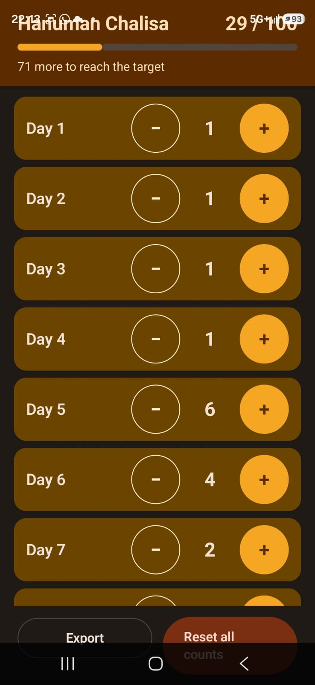

# Chalisa Counter

An offline Android app for tracking a 40-day Hanuman Chalisa sadhana, with a target of 100 recitations.

  

## Installation

Requires Android 7.0 or newer.

1. APK can be downloaded from (D:\Personal-Projects\ChalisaCounter\app\build\outputs\apk\release\app-release.apk)
2. Or the app can be installed from Google Play Store.

## Track your recitations

- Find the row for the day you want to record.
- Tap **+** to add one recitation.
- Tap **−** to remove one if you added it by mistake. Counts cannot go below zero.
- Check the header for your total progress and remaining recitations.

Your counts are saved automatically and remain available when you close and reopen the app.

## Export your progress

Tap **Export** and choose a destination to save a text report of your daily counts, total progress and export date.

You can save the report on your device or to a cloud storage provider available in the file picker. Cloud destinations handle the file under their own terms and privacy policy.

An exported report is a readable record of your progress; the app does not have an import feature.

## Start a new cycle

Tap **Reset all counts** and confirm to clear all 40 days.

Reset cannot be undone in the app. It does not delete exported reports or existing Android backups.

## Your data and privacy

Tap **Your data** for details about storage, backup, exports and deletion. Tap **Privacy policy** to open the full policy in your browser.

- Counts are stored in private app storage on your device.
- The app has no accounts, ads or analytics and does not send your counts to the developer.
- Depending on your device and settings, Android may back up your counts or transfer them to another device.
- Clearing app storage or uninstalling removes local counts. Exported reports and existing backups must be managed separately.

[Read the privacy policy](https://mahajansamiksha.github.io/chalisa-counter-privacy-policy/).
